  

| ID | Name | Met | Screenshot |
| :---: | :--- | :--- | :---: |
| 1. | All the countries in the world organised by largest population to smallest. | Yes | 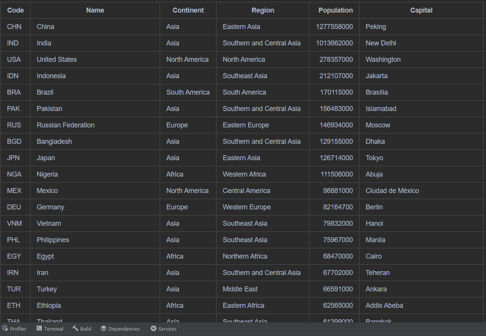 |
| 2. | All the countries in a continent organised by largest population to smallest. | Yes | 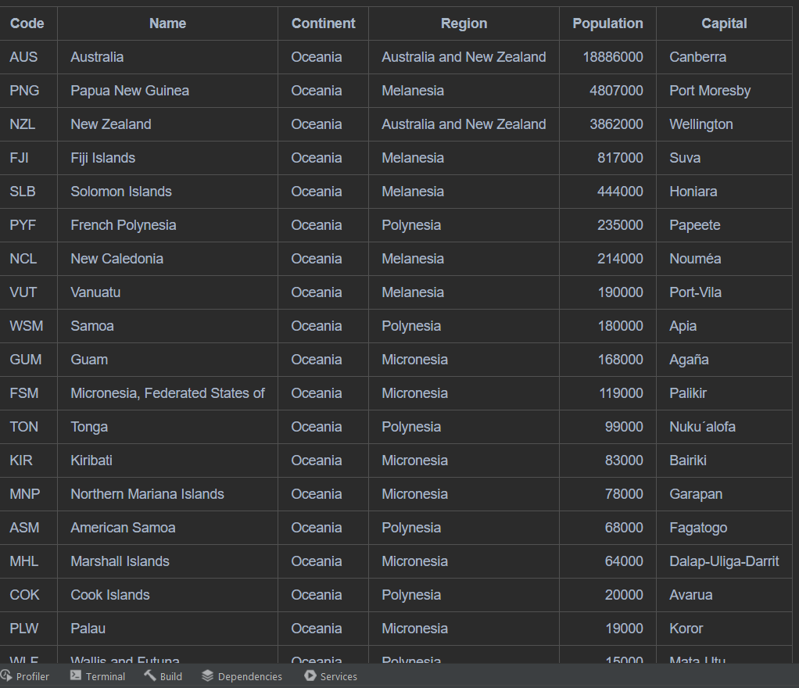 |
| 3. | All the countries in a region organised by largest population to smallest. | Yes | 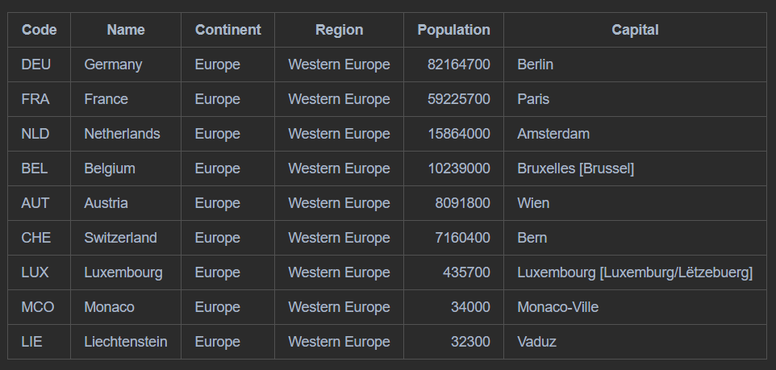 |
| 4. | The top N populated countries in the world where N is provided by the user. | Yes | 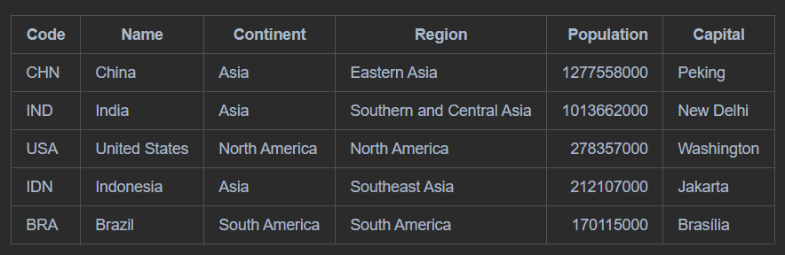 |
| 5. | The top N populated countries in a continent where N is provided by the user. | Yes | 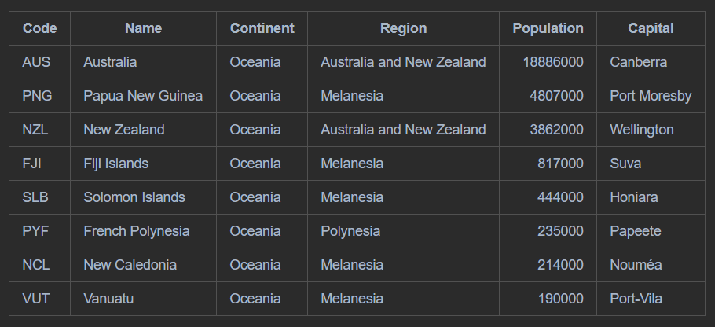 |
| 6. | The top N populated countries in a region where N is provided by the user. | Yes | 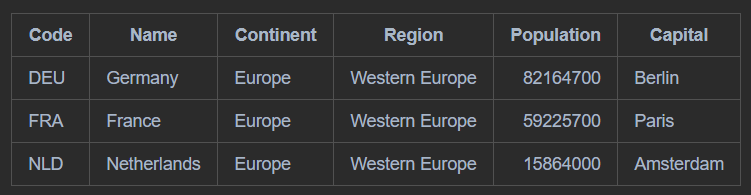 |
| 7. | All the cities in the world organised by largest population to smallest. | COMPLETED? |  |
| 8. | All the cities in a continent organised by largest population to smallest. | COMPLETED? |  |
| 9. | All the cities in a region organised by largest population to smallest. | COMPLETED? |  | 
| 10. | All the cities in a country organised by largest population to smallest. | COMPLETED? |  |
| 11. | All the cities in a district organised by largest population to smallest. | COMPLETED? |  |
| 12. | The top N populated cities in the world where N is provided by the user. | COMPLETED? |  |
| 13. | The top N populated cities in a continent where N is provided by the user. | COMPLETED? |  | 
| 14. | The top N populated cities in a region where N is provided by the user. | COMPLETED? |  |
| 15. | The top N populated cities in a country where N is provided by the user. | COMPLETED? |  |
| 16. | The top N populated cities in a district where N is provided by the user. | COMPLETED? |  |
| 17. | All the capital cities in the world organised by largest population to smallest. | COMPLETED? |  |
| 18. | All the capital cities in a continent organised by largest population to smallest. | COMPLETED? |  |
| 19. | All the capital cities in a region organised by largest to smallest. | COMPLETED? |  | 
| 20. | The top N populated capital cities in the world where N is provided by the user. | COMPLETED? |  | 
| 21. | The top N populated capital cities in a continent where N is provided by the user. | COMPLETED? |  | 
| 22. | The top N populated capital cities in a region where N is provided by the user. | COMPLETED? |  | 
| 23. | The population of people, people living in cities, and people not living in cities in each continent. | COMPLETED? |  | 
| 24. | The population of people, people living in cities, and people not living in cities in each region. | COMPLETED? |  | 
| 25. | The population of people, people living in cities, and people not living in cities in each country. | COMPLETED? |  | 
| 26. | The population of the world. | Yes | 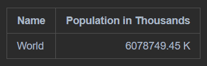 | 
| 27. | The population of a continent. | Yes | 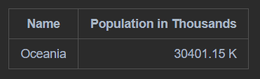 | 
| 28. | The population of a region. | Yes | 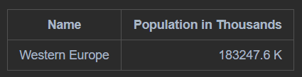 | 
| 29. | The population of a country. | Yes | 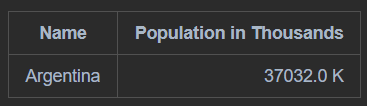 | 
| 30. | The population of a district. | Yes | 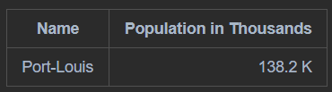 | 
| 31. | The population of a city. | Yes | 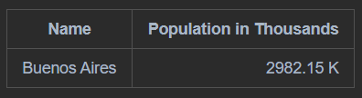 | 
| 32. | The number of people who speak the following the following languages from greatest number to smallest, including the percentage of the world population:  Chinese, English, Hindi, Spanish, Arabic. | COMPLETED? |  | 