# SET08103  
&emsp;&emsp;<u>Group Project</u>  

&emsp;&emsp;  
* License:&emsp;&emsp;&emsp;&emsp;&emsp;&ensp;&nbsp;&nbsp;   
* Release:&emsp;&emsp;&emsp;&emsp;&emsp;&ensp;&ensp;   
* Main Build Status:&emsp;&ensp;&nbsp;   
* Release Build Status: &ensp;   
* Develop Build Status: &nbsp; 
* CodeCov Build Status:	    
 

| ID | Name | Met | Screenshot |
| :---: | :---: | :---: | :---: |
| 1. | All the countries in the world organised by largest population to smallest. | Yes | 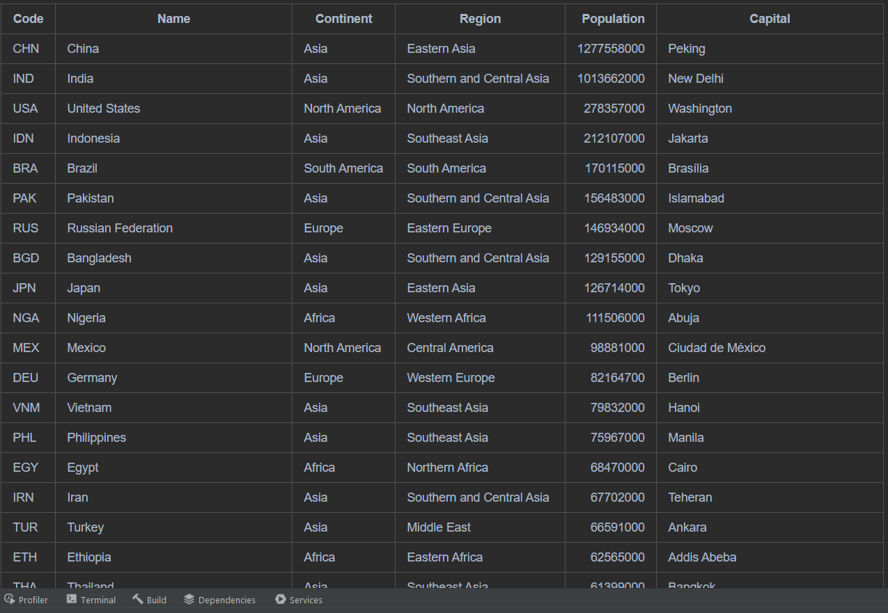 |
| 2. | All the countries in a continent organised by largest population to smallest. | Yes | 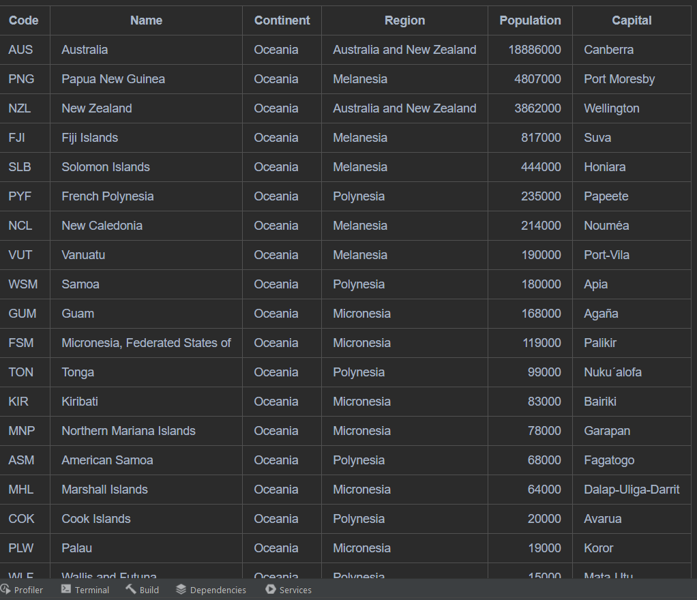 |
| 3. | All the countries in a region organised by largest population to smallest. | Yes | 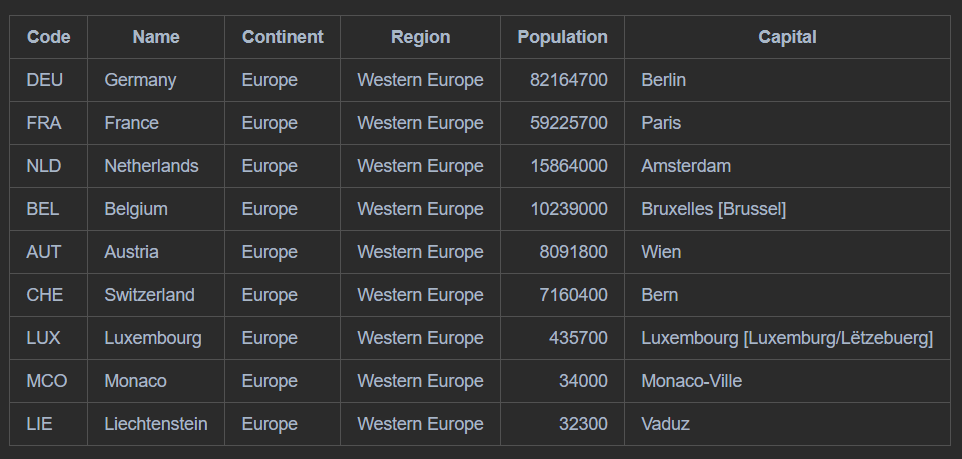 |
| 4. | The top N populated countries in the world where N is provided by the user. | Yes |  |
| 5. | The top N populated countries in a continent where N is provided by the user. | Yes | 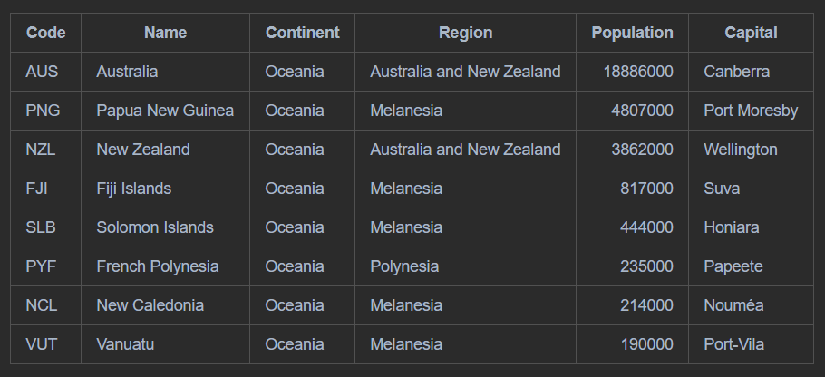 |
| 6. | The top N populated countries in a region where N is provided by the user. | Yes | 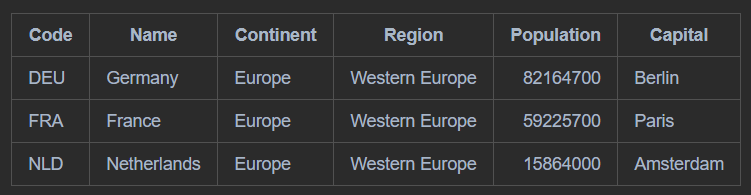 |
| 7. | All the cities in the world organised by largest population to smallest. | Yes | 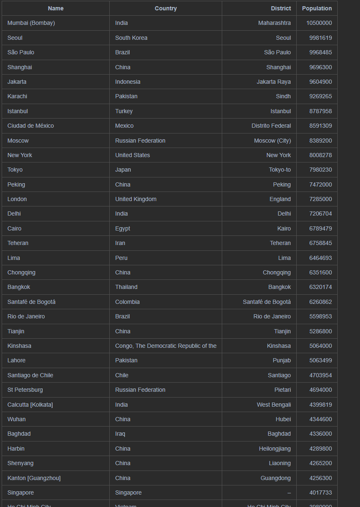 |
| 8. | All the cities in a continent organised by largest population to smallest. | Yes | 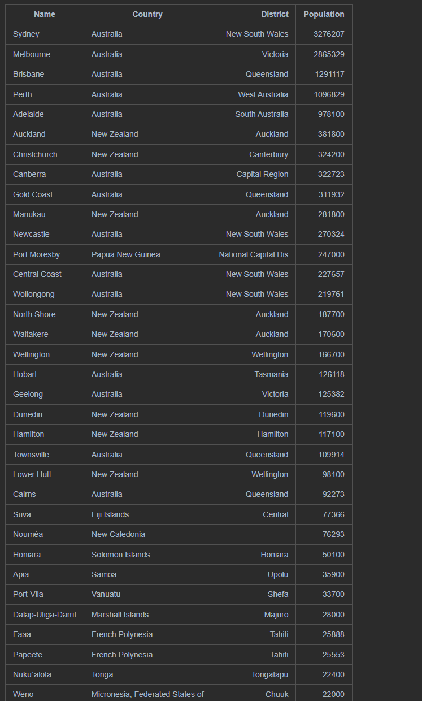 |
| 9. | All the cities in a region organised by largest population to smallest. | Yes | 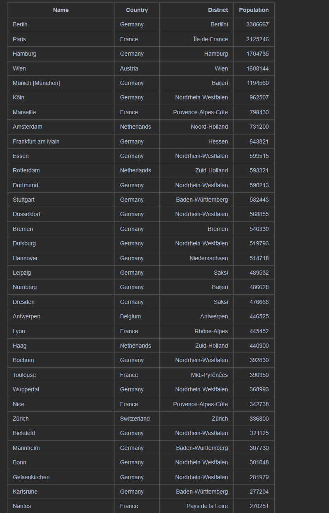 | 
| 10. | All the cities in a country organised by largest population to smallest. | Yes | 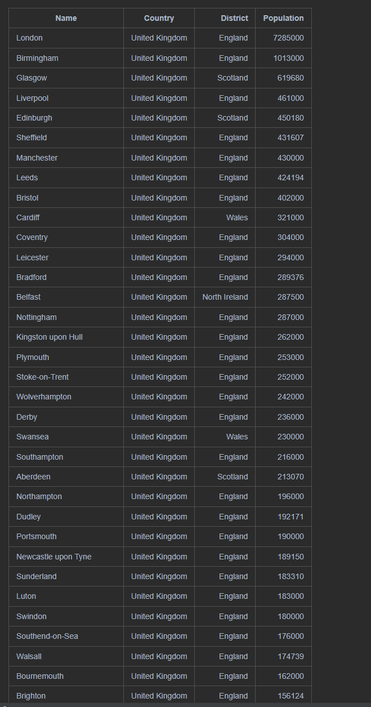 |
| 11. | All the cities in a district organised by largest population to smallest. | Yes | 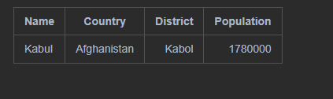 |
| 12. | The top N populated cities in the world where N is provided by the user. | Yes | 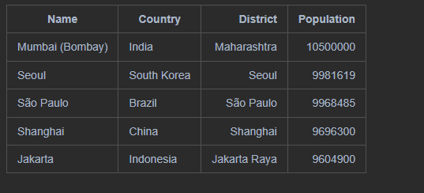 |
| 13. | The top N populated cities in a continent where N is provided by the user. | Yes | 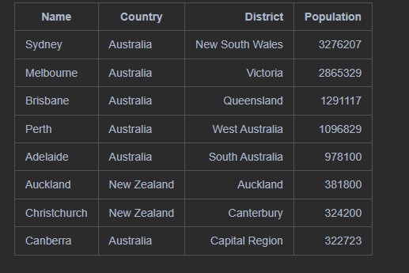 | 
| 14. | The top N populated cities in a region where N is provided by the user. | Yes | 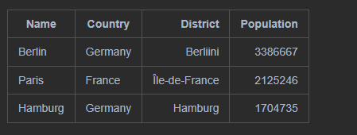 |
| 15. | The top N populated cities in a country where N is provided by the user. | Yes | 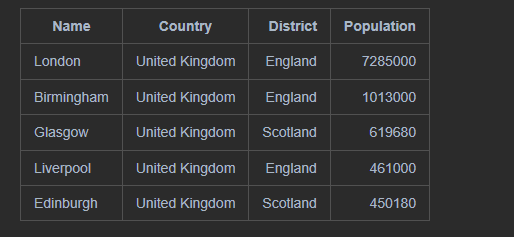 |
| 16. | The top N populated cities in a district where N is provided by the user. | Yes | 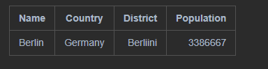 |
| 17. | All the capital cities in the world organised by largest population to smallest. | No |  |
| 18. | All the capital cities in a continent organised by largest population to smallest. | No |  |
| 19. | All the capital cities in a region organised by largest to smallest. | No |  | 
| 20. | The top N populated capital cities in the world where N is provided by the user. | No |  | 
| 21. | The top N populated capital cities in a continent where N is provided by the user. | No |  | 
| 22. | The top N populated capital cities in a region where N is provided by the user. | No |  | 
| 23. | The population of people, people living in cities, and people not living in cities in each continent. | Yes | 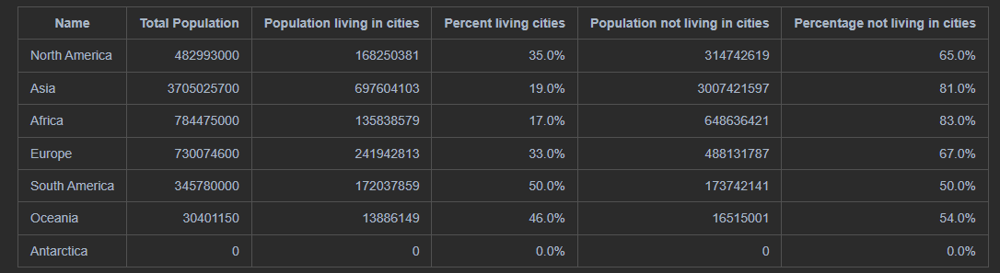 | 
| 24. | The population of people, people living in cities, and people not living in cities in each region. | Yes | 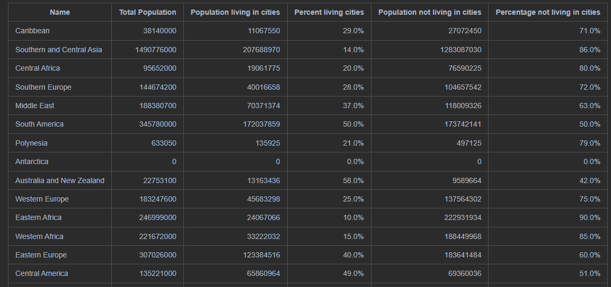 | 
| 25. | The population of people, people living in cities, and people not living in cities in each country. | Yes | 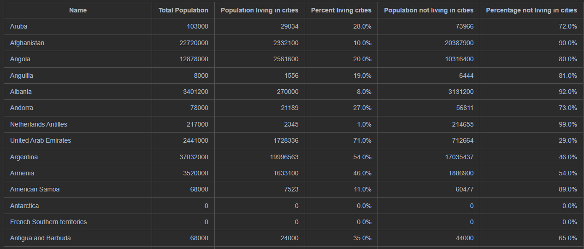 | 
| 26. | The population of the world. | Yes | 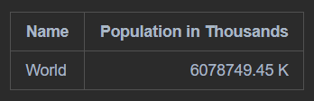 | 
| 27. | The population of a continent. | Yes | 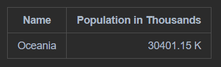 | 
| 28. | The population of a region. | Yes | 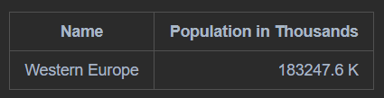 | 
| 29. | The population of a country. | Yes | 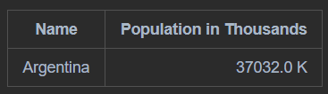 | 
| 30. | The population of a district. | Yes | 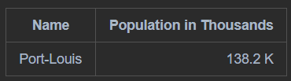 | 
| 31. | The population of a city. | Yes | 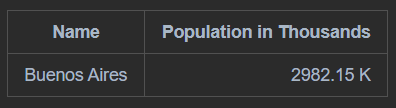 | 
| 32. | The number of people who speak the following the following languages from greatest number to smallest, including the percentage of the world population:  Chinese, English, Hindi, Spanish, Arabic. | Yes | 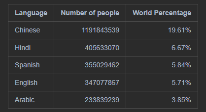 | 

Notes:  
To up-date version and create a release-
* Update in pom.xml (version) and Dockerfile (copy and entry points)
* Rebuild and retest
* Commit and push
* Merge to develop and push
* Merge to release
* From release select 'new tag' using version as tag name (format = v0.1-alpha-2 etc.)
* Push with 'Push tags' checked
* On GitHub, click 'create a new release' - use pre-release if applicable, choose correct tag, add description and comments
* Merge release to master
* Merge release to develop
* Checkout feature branch  
* 11/04/2023 push to check if deployment to Gitub
* 17/04/2023 push to check if deployment ot GitHub is
* 21/04/2023 junit packages reloaded and pushed
* 21/04/2023 added deloyment permissions to main.xml
* 24/04/2023 re-push to correct mising objects in languages unit test